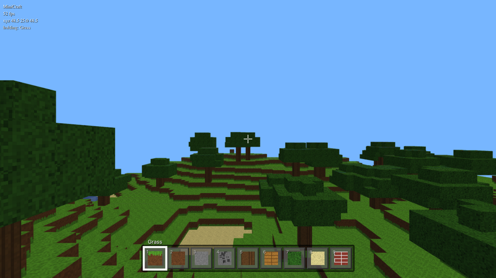

# MiniCraft

<p align="center">
  
</p>

A voxel sandbox that runs entirely in your browser: explore a generated 96×96×48 world, break blocks, place blocks. No server, no account, no asset files — every texture is drawn pixel by pixel in code at startup.

- Terrain, beaches, water and trees from layered simplex noise
- Chunked meshing (16×16×48 chunks) — only exposed faces are uploaded to the GPU
- Pointer-lock mouse look, with a drag-to-look fallback where pointer lock is unavailable (embedded previews)

## Quick start

You need Node.js 20.19 or newer (22 works too).

```bash
npm install
npm run dev
```

Open http://localhost:5173 and click **Click to Play**.

## Controls

| Input | Action |
| --- | --- |
| W A S D | Move |
| Space | Jump (hold Shift to sprint) |
| Mouse | Look |
| Left click | Break block |
| Right click | Place block |
| 1–9 or scroll | Select block |
| Esc | Pause |

## Scripts

| Command | What it does |
| --- | --- |
| `npm run dev` | Dev server with hot reload at http://localhost:5173 |
| `npm run build` | Typecheck, then production build into `dist/` |
| `npm run preview` | Serve the production build locally |
| `npm run typecheck` | `tsc --noEmit` only |

## How it works

| Piece | File | Notes |
| --- | --- | --- |
| World generation | `src/world.ts` | Three octaves of simplex noise over a fixed seed (1337), so every visitor gets the same world |
| Chunk renderer | `src/world.ts` | Greedy per-face meshing; editing a block rebuilds only its chunk (and neighbors when on a border) |
| Physics | `src/player.ts` | Axis-separated AABB collision, gravity, jump, 5.5-block reach raycast |
| Textures | `src/textures.ts` | Procedural 16×16 tiles composited into a 4×4 atlas on a `<canvas>`, nearest-neighbor filtered |
| Blocks & hotbar | `src/blocks.ts`, `src/ui.ts` | 9 placeable block types, each defined by tiles and solid/opaque flags |

## Known limitations

- **No saving.** Edits are lost when you refresh the page.
- **Fixed world.** 96×96×48 blocks, generated once at load; the seed is constant.
- **Desktop only.** There are no touch controls.
- **Water is a surface.** It renders from above only; swimming and underwater faces are not modeled.
- **Esc and pointer lock.** The browser intercepts Esc to release the mouse; click Play again to recapture.

## Troubleshooting

**The mouse doesn't lock and I can't look around.** You are probably inside an embedded preview where the browser blocks pointer lock. Drag with the mouse to look; clicks still break and place blocks.

**`npm run dev` fails with a Node version error.** Vite 8 requires Node 20.19+. Check with `node --version` and upgrade.

## License

[MIT](LICENSE) — Mohamed Taaouach
